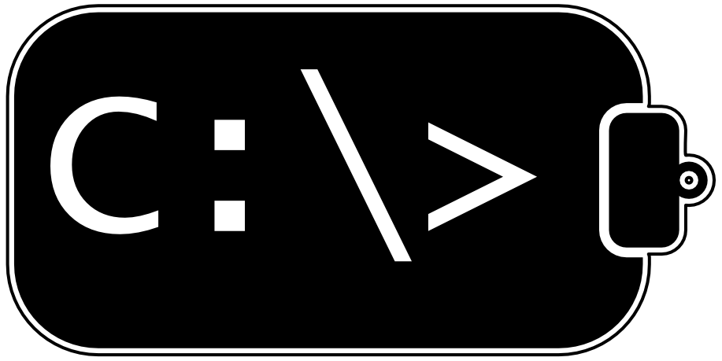

# CBECHO



```
C:\> cbecho --help
CBECHO version 1.0a
Copyright 2021 G. Adam Stanislav
All rights reserved

Usage: cbecho [options] [file]

	cbecho -# (strip off # number characters)
	cbecho -B (insert BE BOM)
	cbecho -C (do not convert Unicode to UTF-8)*
	cbecho -L (insert LE BOM)
	cbecho -O file (append the output to the file)
	cbecho -P (preserve BOM)*
	cbecho -R (remove BOM)
	cbecho -U (try Unicode first)*
	cbecho -a [-o] file (save file in ANSI)
	cbecho -b (bypass Unicode)
	cbecho -c (convert Unicode to UTF-8)
	cbecho -e (empty the clipboard after output)
	cbecho -h (return this message)
	cbecho -k (do not empty the clipboard)*
	cbecho -n (do not swap Unicode bytes)*
	cbecho -o file (send the output to the file)
	cbecho -s (swap Unicode bytes)
	cbecho -u [-o] file (save in Unicode if available)*
	cbecho -v (print the version)
	cbecho -w (wipe the clipboard)

	* marks the default setting.
	If the last argument is just -o or -O, the output is stdout.
	Because this is Windows, you can use / instead of -.
C:\>
```

## GUI vs. CLI

There are two main types of computer programs. One interacts with a user
through a _graphical user interface_ (`GUI`). The other gets its input
through a standard input (`stdin`) and sends its output to a standard output
(`stdout`), generally in the form of some text through a _command line
interface_ (`CLI`).

In `CLI`, the standard input can come from a computer keyboard, or a file, or
a device, or some other source. The program neither knows nor cares where it
comes from. Similarly, the standard output can go to a monitor, a printer,
a file, a device, wherever. Again, the program neither knows nor cares where
the output goes. It is even possible to pipe `stdout` of one `CLI` program
to `stdin` of another `CLI` program by typing a vertical bar (`|`) between
their names.

> __HINT:__ Some people talk about `DOS` programs when they actually mean
> Windows `CLI` programs. This is because the early versions of MS Windows
> ran on top of `MS DOS` (Microsoft Disk Operating System), and its command
> line window was designed to run `CLI` software written for `MS DOS`.
>
> But for decades now the `CLI` programs written for Windows command line
> no longer are `MS DOS` programs and should not be called `DOS` programs
> because most people will assume they are talking about the old 20th Century
> programs. So unless you want to confuse people, call them comand line
> programs or `CLI` programs, not `DOS` programs. Only say *`DOS` programs*
> if you are talking about actual `MS DOS` software.

### Bridging GUI and CLI

Microsoft Windows comes with a `CLI` utility called `clip`, which accepts its
input from `stdin` and sends its output as plain text to the Windows clipboard.
That text can then be pasted to `GUI` programs, thus bridging one half of the
gap between `GUI` and `CLI` programs. For example,

```
C:\> dir | clip
```

This will copy the directory listing of the `C:\` folder to the clipboard, from
where it can be pasted to a text editor, or an HTML editor, or many other `GUI`
programs.

Recently, I needed to move in the opposite direction, i.e., to copy a portion
of text from a text editor and somehow send it to the standard input of a `CLI`
program, which processed the text and sent the result to its standard output.

At first I would copy and paste that text to a temp file. I then redirected
that file to a chain of small `CLI` programs. Something like this:

```
C:\> program1 < temp.txt | program2 | program3 | clip
```

Then I could paste the result to my `GUI` editor.

Doing so once is no big deal. Doing so repeatedly is tedious. It is also easy
to make mistakes. So to bridge the other half of the gap between `CLI` and
`GUI`, I wrote `cbecho`, which stands for `clipboard echo`. It sends any plain
text present in Windows clipboard to its `stdout`. Now I can just
copy the text, but instead of using a temp file, I type something like this,

```
C:\> cbecho | program1 | program2 | program3 | clip
```

Much simpler and much faster!

Between `clip` and `cbecho`, the bridge between `GUI` and `CLI` software
is now complete.

> __HINT:__ If you wanted to copy the output of the `dir` command to
> the clipboard, but still see it in your command line window, try this,
>
> ```
> C:\> dir | clip & cbecho
> ```

## Using cbecho

In most cases, all you need to do is just type `cbecho` on the command line,
and if there is any plain text, whether Unicode or ANSI (or other local text),
on the clipboard, `cbecho` will send it to `stdout`, from where you can pipe
it to other programs, or redirect it to a device, etc.

It does, however, offer various options. To see them, just type any of the
following,

```
C:\> cbecho -h
C:\> cbecho /?
C:\> cbecho --help
```

That will list all of its command line switches, [just as shown above](#cbecho).
If you have the `CBECHO` environment variable set, it will list that as well.

If you just need to know what version of `cbecho` you have, you can type one
of these two,

```
C:\> cbecho -v
C:\> cbecho --version
```

### The options

#### Output length

By default, `cbecho` will print the text just as it is stored on the clipboard.
Some Windows programs append an extra carriage return and line feed to the text
before copying it to the clipboard. You can strip them with this option,

```
C:\> cbecho -2
```

Note that the `-` just denotes a command line switch, not the minus sign.
So this would give you the same result,

```
C:\> cbecho /2
```

Indeed in any of the options that start with a single `-` you can use a `/`
instead. Except that I noticed the slash does not work in `git-bash` which
apparently assumes it is denoting a path. That is why I always use the dash
instead.

You can strip any number (theoretically up to 2,147,483,647) of trailing
characters by typing the number (without any commas, so up to 2147483647) as a
switch. For example, this strips the last 50 characters (and will show nothing
if there are only 50 or fewer characters of text on the clipboard),

```
C:\> cbecho -50
```

By the way, if you use this switch more than once, only the last occurrence
will count (this is true with any switches that may ask for contradicting
actions). So you can know how many characters will be stripped if you type,

```
C:\> cbecho -17 -b -2147483647 -U -0
```

None of them will be stripped because the zero switch appears after the
other numeric switches \(also the `-U` cancels out the `-b`,
[as shown below](#bypassing-unicode)\).

#### Working with Unicode

Windows allows programs to copy all kinds of data to the clipboard, not just
plain text. Even with the plain text, it can be Unicode text, ANSI text, or
simple text. By default, `cbecho` first checks if any Unicode text is on the
clipboard. Only if it does not find Unicode, will it check for ANSI text and
simple text.

Now, Unicode is simply a list of various characters with a unique number
assigned to each. Originally, all those numbers could be expressed as 16-bit
data. Microsoft Windows was one of the early adopters of Unicode, so when we
are talking about “Unicode” in Windows context, we specifically mean that
16-bit implementation.

Additionally, in different types of computer architecture, 16 bits is
represented differently. They typically store 16 bits in two adjacent 8-bit
bytes. But some of them, called low-endian (`LE`), store the lower 8 of the 16
bits before the bigger 8 of the 16 bits. Others, called big-endian (`BE`), store
the bigger 8 bits before the lower 8 bits.

##### Bypassing Unicode

You can avoid all that by instructing `cbecho` to bypass the Unicode text
and go straight to looking for ANSI text or simple text like this,

```
C:\> cbecho -b 
```

You can also tell it to search for Unicode text first after all like this,

```
C:\> cbecho -U
```

That is the _capital_ leter `U`.

##### The byte order

Windows runs mostly on Intel microprocessors, which use the `LE` architecture.
So, when some text is present on Windows clipboard as Unicode, individual
characters (and other Unicode values) are stored as low-end-byte-first 16-bit
values. As long as we are passing Unicode text among various Windows processes,
this presents no problem.

Once, however, we store such text in a file that may be shared with software
running on a different system, we need to make it clear that the data is `LE`.
Or perhaps even swap the two bytes of each 16-bit value and make it clear the file is `BE`.

###### The byte swap

If you need to swap the two bytes in each 16-bit Unicode value, use

```
C:\> cbecho -s
```

Now the data that was `LE` is `BE`. Of course, if for some reason the
clipboard Unicode data was `BE`, now it will be `LE`.

And to explicitly state you do not wish the byte swap, use,

```
C:\> cbecho -n
```

That is the default anyway \(unless your [system preferences](#preferences)
say otherwise\).

###### The BOM

To indicate whether the 16-bit Unicode data is stored in a file as `LE` or
`BE`, such a file usually starts with the _byte-order mark,_ or `BOM`. Its
hexadecimal value is `FEFF`. That means that in a file with a `BOM`, the first
byte is `FE` and the second byte `FF` if it contains `BE` Unicode text; while
the first byte is `FF` and the second byte `FE` if it contains `LE` Unicode
text (such as normally produced by Windows software).

There are four different mutually exclusive switches for dealing with a `BOM`
in `cbecho`.

```
C:\> cbecho -B
C:\> cbecho -L
C:\> cbecho -P
C:\> cbecho -R
```

The `-B` switch will make sure the 16-bit Unicode output is preceded by a
`BE BOM`. The `-L` switch will make sure the 16-bit Unicode output is preceded
by an `LE BOM`. The `-P` switch will _preserve_ a `BOM` if it already is
present at the start of the 16-bit Unicode text read from the clipboard, but
will not add one on its own (though it will swap its bytes if the `-s` switch
is also active). Finally, the `-R` switch will remove any `BOM` the 16-bit
Unicode text may be started with.

Remember, you usually want a `BOM` if you are saving a 16-bit Unicode text in
a file. And you usually do _not_ want a `BOM` in other cases. But it is your
choice, as I cannot foresee every possible use of `cbecho`.

##### UTF-8

A very common way of encoding Unicode is `UTF-8`. It uses a variable number
of bytes. Its size is smaller than the two-byte 16-bit Windows version for
European languages, but generally larger for Chinese script and similar.

However, perhaps its main advantage is the ability to encode Unicode values
that are too large for 16 bits.

```
C:\> cbecho -c
```

This switch tells `cbecho` to convert any 16-bit Unicode from the clipboard
into `UTF-8`. By default it will not start such converted text with a `BOM` as
it is usually not required but may confuse some software. You can, however,
force `cbecho` to start with a `UTF-8 BOM` by using either the `-B` or the
`-L` switch. It does not matter which one of the two.

```
C:\> cbecho -C
```

This option (that is the capital `C`) tells `cbecho` _not_ to convert to
`UTF-8`. Also, if there is no Unicode text on the clipboard (or there is, but
you use the `-b` switch to _bypass_ Unicode), no conversion and no `BOM`
will take place.

> __HINT:__ You can use the `-s` switch and the `-c` switch on the same
> command line. That will _swap_ the two 16-bit Unicode bytes before
> _converting_ them to `UTF-8`.
>
> Normally you would only do this if for some reason some software is sending
> `BE` 16-bit Unicode to the clipboard. But there are exceptions to every rule.

#### Output destination

By default, `cbecho` writes its output to `stdout`. You can instruct it to
write to a file instead. Assuming the file name is called `myfile.txt`, any
of these will tell `cbecho` to write to it,

```
C:\> cbecho -o myfile.txt
C:\> cbecho -omyfile.txt
C:\> cbecho myfile.txt
C:\> cbecho -O myfile.txt
C:\> cbecho -O myfile.txt
```

The `-o` switch is optional there. If, however, `-o` is the _last_ switch on
the command line, `cbecho` will send its output to `stdout`. But only if it
is the last. Otherwise it assumes it is followed by a file name, even if it
starts with a `-`, which is a perfectly valid character in a file name.

That is, indeed, why we even have the `-o` switch. While you can normally skip
it and just type the file name, if you do so with a file whose name starts
with a dash, `cbecho` will assume it is a switch. But placing it after the `-o`
switch tells `cbecho` to treat it as a file name. For example, consider these
four possibilities

```
C:\> cbecho -Xantipa.txt
C:\> cbecho -o -Xantipa.txt
C:\> cbecho -Universe.txt
C:\> cbecho -o -Universe.txt
```

The first one will make `cbecho` assume it is meant to be the `-X` switch,
so it will consider it an error. In the second case, it will send its output
to `-Xantipa.txt`. In the third case, it will assume you meant `-U`, so it
will read the Unicode text from the clipboard and write it to `stdout`. In
the fourth case, it will send its output to the file called `-Universe.txt`.

Both `-o` and `-O` are used to select the output file. In either case, if the
file does not exist, `cbecho` will created. If, however, the file exists
already, `-o` will delete it and create a new file by that name, while `-O`
will append the output of `cbecho` to the existing file.

> __HINT:__ As long as you do not tell `cbecho` to empty the clipboard, you
> can chain the command to send its output to several files. Since `cbecho`
> returns `0` (which in command shells means `no error`), chaining with `&&`
> will run the whole chain if there is plain text on the clipboard, but will
> quit after the first `cbecho` exits `1`, meaning there is no plain text on the
> clipboard. For example,
>
> ```
> C:\> cbecho file1.txt && cbecho file2.txt && cbecho -e
> ```
>
> If there is plain text on the clipboard, this will write it to `file1.txt`,
> then to `file2.txt`, then send it to `stdout` and finally empty the clipboard
> (because of the `-e` switch described somewhat below).

#### Output file types

Unlike other operating systems, Windows can treat files as either binary or
text files. I noticed that if I send the output of `cbecho` to a text file,
it is a plain non-Unicode file even if the text comes from the clipboard in
Unicode.

If, on the other hand, I send it to a binary file, the Unicode text remains in
16-bit Unicode, while the ANSI text remains ANSI text.

By default, `cbecho` will treat the file as binary, so Unicode can remain
Unicode (hopefully). This can also be requested explicitly,

```
C:\> cbecho -u filename.txt
```

But you can also request it to be treated as a text file, so Unicode is saved
as ANSI (again, hopefully),

```
C:\> cbecho -a filename.txt
```

#### Clearing the clipboard

Last but not least, by default `cbecho` leaves the data on the clipboard
even after reading it. But you can ask it to empty the clipboard after it
displayed the text (assuming there was some plain text on the clipboard).
You can also ask it to wipe the clipboard without even reading it. That is
useful when some program copied something to the clipboard and left it there
long after it is needed. Removing the data from the clipboard also frees
whatever memory was used to hold that data.

These three options are,

```
C:\> cbecho -k
C:\> cbecho -e
C:\> cbecho -w
```

The `-k` option tells `cbecho` to `keep` the data on the clipboard. The `-e`
option will `empty` the clipboard after potentially sending any plain text from
it to `stdout`. And the `-w` option will `wipe` the clipboard without showing
any output.

Both `-e` and `-w` will leave the clipboard equally empty. The only difference
is that `-e` will first check if there is some plain text on the clipboard
and, if so, will output it.

> __HINT:__ The `-e` option will empty the clipboard after first checking
> for plain text so it can display it if present. But it will still empty
> the clipboard even if it does not find any plain text on it.
>
> What if you wanted to empty the clipboard if and only if there is some
> plain text on it?
> Try,
>
> ```
> C:\> cbecho && cbecho -w
> ```
>
> That will check for the clipboard text. If it finds any, it will display it
> and exit `0`, so the command shell will continue on to the `cbecho -w`, which
> will wipe the clipboard clean. But if it does _not_ find any plain text, it
> will exit `1`, so the command line will stop and `cbecho -w` will not be run,
> so whatever data other than plain text might be on the clipboard will stay
> there.
>
> And what if you wanted to wipe the clipboard only if there is some plain
> text on it, but without `cbecho` displaying the text? Try,
>
> ```
> C:\> cbecho NUL && cbecho -w
> ```


### Preferences

You can override any of the defaults with the command line parameters as
described above. You can also override them permanently or semipermanently
by setting the `CBECHO` environment variable to any of the above options
(note that `-h` and `-v` are not options, they are requests for help or
version, so adding them to the environment variable has no effect).

You cannot specify a file name in the environment variable, only the options.
So, the `o` option will only affirm `stdout` as the output and is, therefore,
redundant, though you can use it if you want.

There is no need to prepend the options in the environment variable with
a dash. For example, this will result in bypassing Unicode, stripping two
characters from the end of the text and emptying the clipboard,

```
set CBECHO=b2e
```

The `cbecho` program checks the environment variable first, the command line
parameters next. And since conflicting parameters are resolved by the last one
standing, you can overturn the preferences set by the environment variable
with command line parameters.

The name of the variable is not case sensitive, but the parameters are (that is
how we can have `-u` and `-U` meaning different things).

## Installation

This is a very simple program entirely contained in the small `cbecho.exe`
file. No need to install it, no need to uninstall it. Just download it and
place it in a folder listed in the `PATH` environment variable. Then you
can use it from the command line as well as from batch files.

The enclosed `cbecho.exe` was compiled for 32-bit Windows, so it works under
both, 32-bit and 64-bit, versions of Windows (though if you expect more than
2GB of text on the clipboard, you would need to recompile for 64-bit Windows).

## License

```
	Copyright 2021, G. Adam Stanislav.
	All rights reserved.

	Permission is hereby granted, free of charge, to any person obtaining a copy
	of this software and associated documentation files (the "Software"), to deal
	in the Software without restriction, including without limitation the rights
	to use, copy, modify, merge, publish, distribute, sublicense, and/or sell
	copies of the Software, and to permit persons to whom the Software is
	furnished to do so, subject to the following conditions:

	The above copyright notice and this permission notice shall be included in all
	copies or substantial portions of the Software.

	THE SOFTWARE IS PROVIDED "AS IS", WITHOUT WARRANTY OF ANY KIND, EXPRESS OR
	IMPLIED, INCLUDING BUT NOT LIMITED TO THE WARRANTIES OF MERCHANTABILITY,
	FITNESS FOR A PARTICULAR PURPOSE AND NONINFRINGEMENT. IN NO EVENT SHALL THE
	AUTHORS OR COPYRIGHT HOLDERS BE LIABLE FOR ANY CLAIM, DAMAGES OR OTHER
	LIABILITY, WHETHER IN AN ACTION OF CONTRACT, TORT OR OTHERWISE, ARISING FROM,
	OUT OF OR IN CONNECTION WITH THE SOFTWARE OR THE USE OR OTHER DEALINGS IN THE
	SOFTWARE.
```